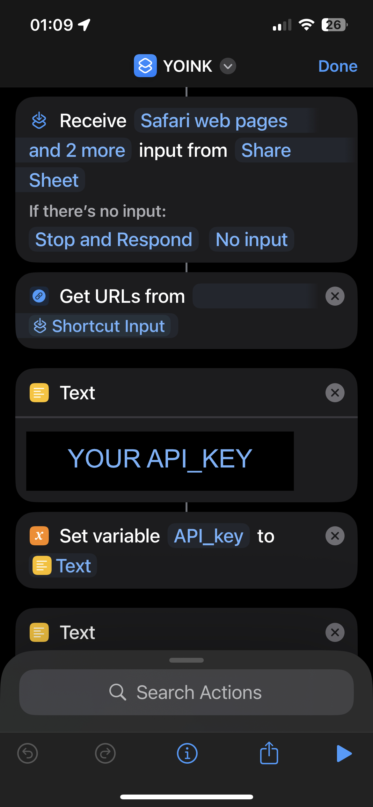
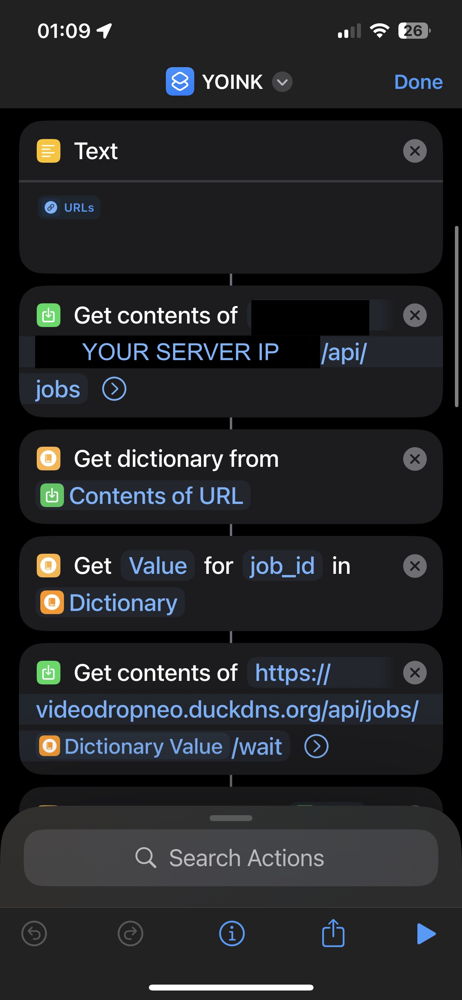
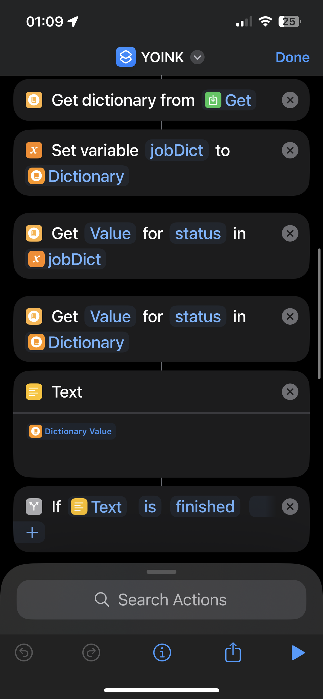
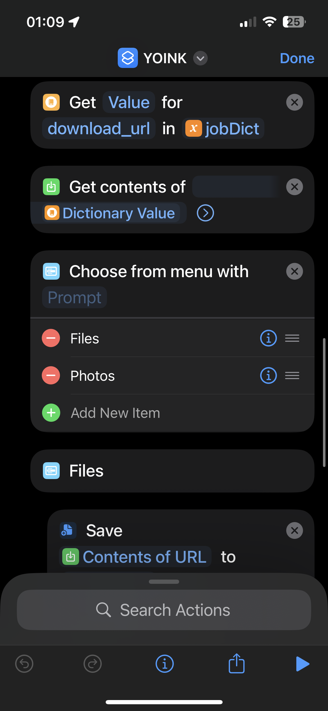
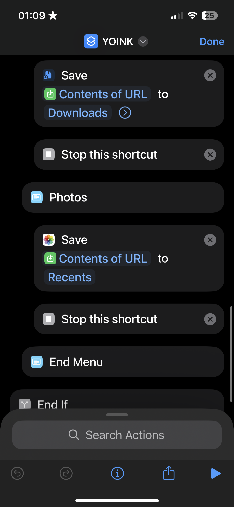

<h1>  Fast Video Downloader & Converter  </h1>

🚀 A clean, minimal API to download and convert Social videos with yt-dlp + ffmpeg + FastAPI.

🌟 Features

    • Spawns yt-dlp downloads as jobs

    • Auto‑reencodes videos to h264 + AAC when needed

    • Fast hardware‑accelerated pipeline for Instagram, TikTok, Facebook sites

    • Simple job queue + automatic cleanup of old files

    • Ready‑to‑use HTTP endpoints for status + file serving

⚙️ How It Works

    ‣ Send a URL → the service starts a yt-dlp download in the background.

    ‣ If it’s Instagram / TikTok / Facebook, it uses a fast ffmpeg + vaapi pipeline.

    ‣ If not, it does a normal ffmpeg encode to h264/AAC.

    ‣ Once done, you get a downloadable video file from /files/{filename}.

✅ Requirements

    ‣ Docker + Docker Compose

    ‣ Container with yt-dlp + ffmpeg + vaapi support (optional)

    ‣ A cookies file (e.g., instagram.txt) mounted outside the repo when needed

🚀 Quick Start

    Create .env (keep this file out of the repo):

    text
    API_KEY=your_secret_api_key_here
    APP_PORT=8093
    DOWNLOAD_DIR=/downloads/finished
    TMP_DIR=/downloads/tmp
    MAX_CONCURRENT=3
    BASE_URL=https://your-domain.com
    LIBVA_DRIVER_NAME=iHD
    
    Mount the cookies file from your host in docker-compose.yml:

    text
    volumes:
      - ./data:/downloads
      - ./app:/code
      - /your/path/cookies/instagram.txt:/code/cookies/instagram.txt:ro
    Start:
    
    bash
    docker compose up -d

🌐 Endpoints

    GET /health
    Health check + current job count and queue size.
    
    POST /api/jobs
    Start a new job. Body: URL, format, mobile, timeouts.
    
    GET /api/jobs/{job_id}
    See current job status (queued, downloading, processing, finished, error).
    
    GET /api/jobs/{job_id}/wait
    Wait for a job to finish (like a short‑polling “wait until ready”).
    
    GET /files/{filename}
    Download the finished video.

🔐 Security

    API_KEY is read from environment, never hardcoded.
    
    Requests need X-API-Key header to be allowed (except /health).
    
    Finished files are auto‑deleted after MAX_JOB_AGE.
    
    Path checks prevent escaping /downloads.
    
    Never commit your .env or instagram.txt into the repo.

📦 Repo Layout

    app/main.py – FastAPI + jobs + yt-dlp/ffmpeg logic
    
    docker-compose.yml – Service config + secrets/volumes
    
    app/cookies/ – ignored by .gitignore (only for local runtime)

<h2>Shortcut screenshots: </h2>

  
  
  
  
  
  
  
  

🤝 Contributing

    Open issues for bugs, ideas, or new “fast‑origin” sites.
    PRs are welcome, but keep secrets outside the repo.

📄 License

    MIT – use it, hack it, break it, fix it, just don’t sue me. 😄

